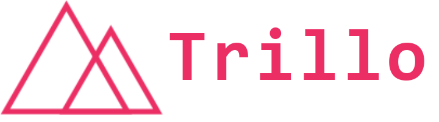
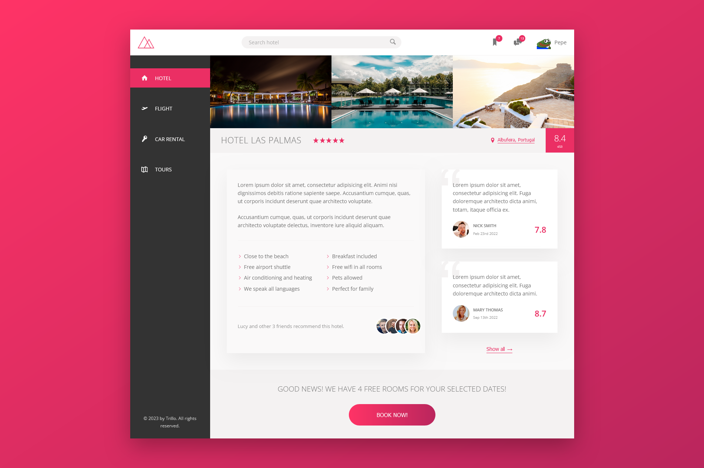
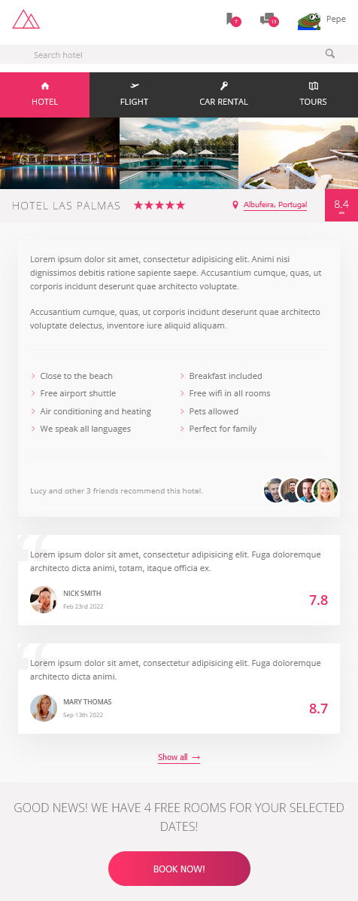

# Trillo - Master Flexbox

Trillo is a static hotel landing page.

## ℹ️ Basic concept

The basic idea when creating Trillo was to learn how to use flex from CSS.


## 🎥 Flexbox and simple animations

In addition to the use of flexbox, the website presents simple animations created using hover.


## 📏 Responsiveness

Thanks to the use of flexbox, the website is fully responsive and adapts to the user's current screen resolution.


# 🛠️ Run Locally

Make sure you have Node and npm installed (https://nodejs.org/en)

Clone the project

```bash
  git clone https://github.com/dosmiko7/TrilloFlexbox
```

Go to the project directory

```bash
  cd TrilloFlexbox
```

Install dependencies and packages

```bash
  npm install
```

Start the server

```bash
  npm run start
```

Open the project in your browser at the default local address http://localhost:5173/

# 💻 Tech Stack

- Node v18.14.2
- npm v8.1.0
- HTML
- SASS
- PostCSS

## 👨‍💻 Author

Mikołaj Oberda
[@dosmiko7](https://www.github.com/dosmiko7)
